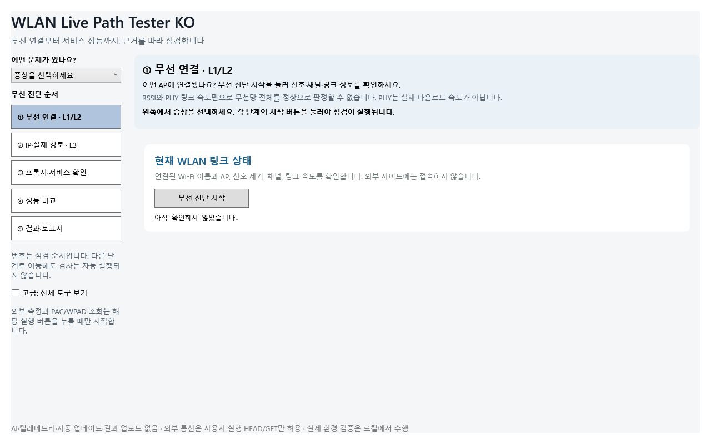
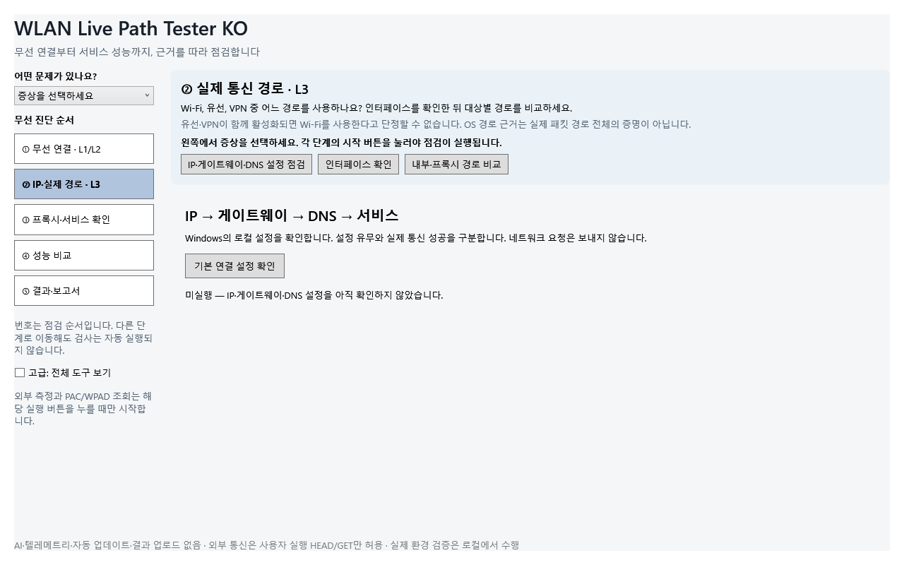
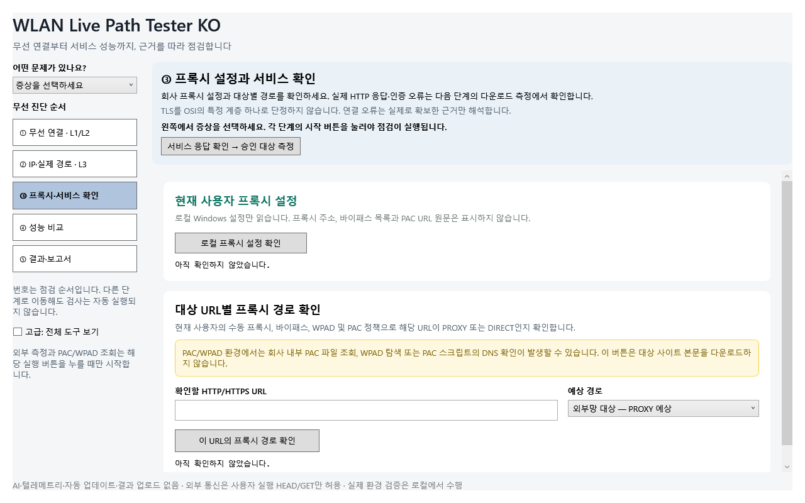
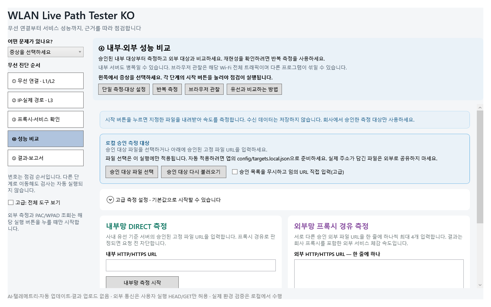
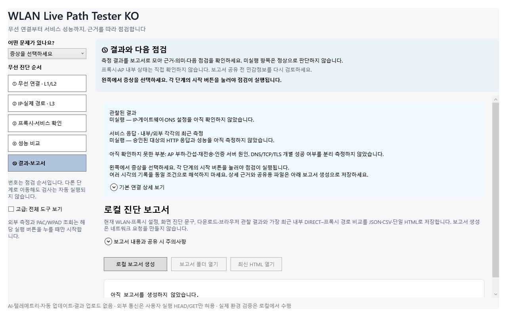

# Windows 화면으로 보는 사용 순서

[README](../README.md) · [측정 방법과 해석 경계](MEASUREMENT_METHOD.md) · [설계·코드 검토](PORTFOLIO_KO.md)

아래는 실제 `MainWindow`의 WPF 화면을 Windows CI에서 렌더한 **측정 전 상태**입니다. 그림으로 만든 목업이나 회사 WLAN 측정 결과가 아닙니다. 실장비·네트워크 수집을 시작하지 않았기 때문에 `미실행`과 `아직 확인하지 않았습니다`가 표시됩니다. 앱에서 단계 이동과 측정 시작은 별도 동작입니다.

## 1. 무선 연결부터 확인



- **행동:** 왼쪽에서 증상을 선택하고 `무선 진단 시작`을 누릅니다.
- **읽을 값:** 연결된 Wi-Fi/AP, 신호 세기, 채널, 링크 속도의 관측값과 수집 실패 여부를 구분합니다.
- **다음 판단:** RSSI나 PHY 링크 속도 하나로 정상·장애를 확정하지 않습니다. 서비스가 느리다면 IP·경로와 성능 비교를 이어갑니다.

## 2. IP 설정과 실제 경로 구분



- **행동:** `기본 연결 설정 확인`으로 로컬 구성을 읽고, 필요한 경우 `인터페이스 확인` 또는 `내부·프록시 경로 비교`를 엽니다.
- **읽을 값:** IP·게이트웨이·DNS가 설정되어 있는지와 어떤 인터페이스가 선택되는지 확인합니다.
- **다음 판단:** 설정이 있다는 사실은 게이트웨이 도달이나 DNS 조회 성공의 증거가 아닙니다. 유선·VPN이 함께 활성화되어 있으면 Wi-Fi로 통신한다고 단정하지 않습니다.

## 3. 프록시 설정과 대상별 경로 확인



- **행동:** `로컬 프록시 설정 확인`을 먼저 사용합니다. 승인된 URL의 경로가 필요할 때 `이 URL의 프록시 경로 확인`을 누릅니다.
- **읽을 값:** 해당 대상이 DIRECT인지 PROXY인지, 로컬 설정과 실행 결과가 일치하는지 확인합니다.
- **주의:** PAC/WPAD 경로 확인은 내부 PAC 조회·탐색·PAC 스크립트의 DNS 확인을 일으킬 수 있습니다. 로컬 설정 읽기와 같은 무통신 동작으로 이해하지 않습니다. 본문 다운로드는 다음 성능 단계에서 시작합니다.

## 4. 승인된 내부·외부 대상 비교



- **행동:** `승인 대상 파일 선택`으로 목록을 불러오거나 허용된 고정 파일 URL을 입력한 뒤 원하는 측정의 시작 버튼을 누릅니다. 비교할 때 대상·조건·반복 횟수를 맞춥니다.
- **읽을 값:** 내부 DIRECT와 외부 프록시 경로의 결과·상태·표본 조건을 함께 봅니다. 브라우저 관찰 값에는 다른 프로그램의 인터페이스 트래픽이 섞일 수 있습니다.
- **화면 범위:** 오른쪽 영역은 세로 스크롤을 사용합니다. 사진 아래로 이어지는 측정 버튼·결과 영역은 앱에서 스크롤해 확인합니다. 이 사진에는 실행한 속도 결과가 없습니다.

## 5. 미실행을 구분하고 보고서 보관



- **행동:** `결과·보고서`에서 관측된 결과와 아직 확인하지 못한 부분을 읽고, 필요하면 `로컬 보고서 생성`을 누릅니다.
- **읽을 값:** 이 예시의 `미실행`은 정상 판정이 아닙니다. AP 부하·간섭·재전송·인증 서버 원인처럼 직접 확인하지 않은 항목을 별도로 읽습니다.
- **다음 행동:** 생성 후 폴더·HTML 열기 버튼으로 저장 결과를 확인합니다. 공유 전 민감정보를 검토하고 상세 문구는 결과 영역을 스크롤해 확인합니다. 저장되지 않은 상태의 버튼은 비활성입니다.

## 화면 출처와 재생성

| 항목 | 근거 |
|---|---|
| 캡처 소스 | [`479c613a`](https://github.com/sebia1993/wlan-live-path-tester-ko/commit/479c613acf8bdd0d3d5eeebff15f843c840535ab) |
| Windows 실행 | [Release Package CI 34175245691](https://github.com/sebia1993/wlan-live-path-tester-ko/actions/runs/34175245691) |
| 실제 렌더 코드 | [GuidedNavigationTests.RenderAsync](../tests/WlanLivePathTester.RouteUiLifetimeSmoke/GuidedNavigationTests.cs) |
| 무수집 초기화 | [TestContext.Prepare](../tests/WlanLivePathTester.RouteUiLifetimeSmoke/TestContext.cs): `Show()`·네이티브 시작·수집기 연결 없이 실제 VisualTree 렌더 |
| 해상도·데이터 | 1280×800, 측정 전 상태·예약된 `.invalid` 시험 입력; OS 창 테두리를 제외한 앱 콘텐츠 |
| 파일 무결성 | [PNG별 SHA-256과 출처](images/usage/capture-manifest.json) |

Windows와 저장소가 지정한 .NET SDK에서 저장소 루트 기준으로 재생성할 수 있습니다.

```powershell
$env:WLAN_GUIDED_RENDER_DIRECTORY = Join-Path (Get-Location) 'artifacts/guided-layout'
powershell -NoProfile -ExecutionPolicy Bypass -File .\scripts\verify-release.ps1 -Configuration Release
```

처음 SDK·도구를 준비할 때는 다운로드가 필요할 수 있습니다. 렌더 시험은 실제 사내 WLAN·프록시·다운로드 사이트에 접속하지 않습니다. 재캡처 결과는 글자·스크롤·버튼 상태를 직접 확인한 뒤 문서에 반영합니다. 화면 렌더 통과와 실제 회사 PC의 WLAN·PAC·EDR/GPO 동작 검증은 별개입니다.
